# CollabGrid 数据库 ER 关系图

> 基于 `db.js`（SQLite）、`pgAdapter.js`（PostgreSQL）、`publicDb.js`（公开查询库）及 `db/migrations/` 目录中的实际建表 DDL 生成。

---

## 1. 概述

CollabGrid 采用 **SQLite / PostgreSQL 双引擎** 架构：

- **主库**：`collab-grid.db`（SQLite）或 PostgreSQL，承载全部业务核心数据
- **公开库**：`collab-grid-public.db`（SQLite）或 PostgreSQL public schema，仅承载外部客户可见的快照、对账、访问日志

### 统一约定

| 约定项 | 说明 |
|--------|------|
| **ID 格式** | 统一使用 `VARCHAR(21)` nanoid（SQLite 中为 `TEXT`，PG 中为 `VARCHAR(21)`） |
| **时间戳** | 统一使用 `BIGINT` 毫秒级 Unix 时间戳（SQLite 中为 `INTEGER`，PG 中为 `BIGINT`） |
| **布尔值** | SQLite 中用 `INTEGER 0/1`，PostgreSQL 中也用 `INTEGER 0/1`（兼容迁移） |
| **级联删除** | 所有核心外键均设置 `ON DELETE CASCADE` |
| **迁移框架** | `db/migrate.js` 管理 `db/migrations/` 下的增量迁移，`schema_version` 表记录版本号 |

---

## 2. ER 关系图（Mermaid erDiagram）

```mermaid
erDiagram
    users {
        TEXT id PK "用户唯一标识 (nanoid 21)"
        TEXT email UK "登录邮箱"
        TEXT password_hash "bcrypt 哈希"
        TEXT display_name "显示名称"
        TEXT system_role "系统角色 (PG独有): sys_admin/data_engineer/none"
        INTEGER must_change_password "是否需要改密码 (PG独有)"
        BIGINT password_changed_at "密码修改时间 (PG独有)"
        BIGINT created_at "创建时间"
        BIGINT deleted_at "软删除时间 (PG独有)"
    }

    bases {
        TEXT id PK "Base 唯一标识"
        TEXT name "Base 名称"
        TEXT owner_id FK "所有者 -> users.id"
        BIGINT created_at "创建时间"
    }

    members {
        TEXT base_id PK,FK "Base -> bases.id"
        TEXT user_id PK,FK "用户 -> users.id"
        TEXT role "角色: manager/business/data_clerk/support/warehouse"
        BIGINT joined_at "加入时间"
    }

    tables {
        TEXT id PK "表唯一标识"
        TEXT base_id FK "所属 Base -> bases.id"
        TEXT name "表名"
        INTEGER position "排序位置"
        INTEGER hidden "是否隐藏 (PG独有)"
        BIGINT created_at "创建时间"
    }

    fields {
        TEXT id PK "字段唯一标识"
        TEXT table_id FK "所属表 -> tables.id"
        TEXT name "字段名"
        TEXT type "字段类型"
        TEXT options "JSON 配置"
        INTEGER locked "是否锁定"
        INTEGER width "列宽 (默认160)"
        INTEGER position "排序位置"
        BIGINT created_at "创建时间"
    }

    records {
        TEXT id PK "记录唯一标识"
        TEXT table_id FK "所属表 -> tables.id"
        INTEGER height "行高 (默认34)"
        INTEGER locked "是否锁定"
        INTEGER position "排序位置"
        BIGINT created_at "创建时间"
        BIGINT updated_at "更新时间"
        BIGINT deleted_at "软删除时间 (PG独有)"
    }

    cells {
        TEXT record_id PK,FK "记录 -> records.id"
        TEXT field_id PK,FK "字段 -> fields.id"
        TEXT value "单元格值"
        TEXT style_json "样式 JSON"
        BIGINT updated_at "更新时间"
        TEXT updated_by "更新者用户 ID"
    }

    links {
        TEXT id PK "链接唯一标识"
        TEXT field_id FK "关联字段 -> fields.id"
        TEXT from_record_id FK "源记录 -> records.id"
        TEXT to_record_id FK "目标记录 -> records.id"
        BIGINT created_at "创建时间"
    }

    attachments {
        TEXT id PK "附件唯一标识"
        TEXT base_id "所属 Base"
        TEXT record_id "关联记录"
        TEXT field_id "关联字段"
        TEXT file_name "原始文件名"
        TEXT file_type "MIME 类型"
        INTEGER file_size "文件大小(字节)"
        TEXT file_path "存储路径"
        TEXT uploaded_by "上传者用户 ID"
        BIGINT created_at "创建时间"
    }

    invites {
        TEXT token PK "邀请令牌"
        TEXT base_id FK "目标 Base -> bases.id"
        TEXT role "邀请角色"
        TEXT created_by "创建者用户 ID"
        BIGINT created_at "创建时间"
        BIGINT expires_at "过期时间"
    }

    audit_log {
        TEXT id PK "日志唯一标识"
        TEXT base_id "所属 Base"
        TEXT table_id "所属表"
        TEXT record_id "关联记录"
        TEXT field_id "关联字段"
        TEXT old_value "变更前值"
        TEXT new_value "变更后值"
        TEXT action "操作类型 (默认 cell.update)"
        TEXT user_id "操作者用户 ID"
        TEXT user_email "操作者邮箱"
        BIGINT created_at "创建时间"
    }

    job_configs {
        TEXT base_id PK,FK "所属 Base -> bases.id"
        TEXT job_key PK "任务标识"
        INTEGER enabled "是否启用"
        INTEGER dry_run "是否试运行"
        INTEGER batch_size "批处理大小 (默认2000)"
        INTEGER max_runtime_ms "最大运行时间 (默认120000ms)"
        TEXT config_json "配置 JSON"
        INTEGER schedule_enabled "是否启用定时调度"
        TEXT schedule_time "调度时间 (cron表达式)"
        TEXT schedule_business_date_mode "业务日期模式 (默认today)"
        INTEGER schedule_dry_run "调度是否试运行"
        TEXT schedule_last_run_date "上次调度日期"
        INTEGER schedule_last_run_at "上次调度时间戳"
        TEXT schedule_last_run_status "上次调度状态"
        BIGINT updated_at "更新时间"
    }

    job_runs {
        TEXT id PK "运行唯一标识"
        TEXT base_id FK "所属 Base -> bases.id"
        TEXT job_key "任务标识"
        TEXT business_date "业务日期"
        TEXT mode "运行模式"
        TEXT status "运行状态"
        BIGINT started_at "开始时间"
        BIGINT finished_at "结束时间"
        INTEGER scanned_count "扫描数量"
        INTEGER changed_count "变更数量"
        INTEGER error_count "错误数量"
        TEXT summary_json "摘要 JSON"
        TEXT error_json "错误 JSON"
        TEXT created_by "触发者用户 ID"
    }

    commission_ledger {
        TEXT id PK "分录唯一标识"
        TEXT base_id FK "所属 Base -> bases.id"
        TEXT batch_no "批次号"
        TEXT business_date "业务日期"
        TEXT order_record_id "订单记录 ID"
        TEXT lock_record_id "锁仓记录 ID"
        TEXT side "方向: buy/sell"
        TEXT channel_record_id "渠道记录 ID"
        TEXT product_record_id "产品记录 ID"
        REAL snapshot_profit "快照利润"
        REAL rate "佣金费率"
        REAL amount "佣金金额"
        TEXT type "类型: normal/reversal (默认normal)"
        TEXT original_ledger_id UK "原始分录 (红冲时引用)"
        BIGINT created_at "创建时间"
    }

    order_activity_daily {
        TEXT base_id PK,FK "所属 Base -> bases.id"
        TEXT business_date PK "业务日期"
        TEXT side PK "方向: buy/sell"
        TEXT channel_record_id PK "渠道记录 ID"
        TEXT product_record_id PK "产品记录 ID (默认空串)"
        INTEGER valid_order_count "有效订单数 (默认0)"
        REAL gross_profit_sum "毛利合计 (默认0)"
        BIGINT updated_at "更新时间"
    }

    permission_overrides {
        SERIAL id PK "自增主键 (PG独有表)"
        TEXT scope "作用域: system/base/external"
        TEXT role "角色"
        TEXT base_id "Base ID (base scope 时)"
        TEXT permission "权限码"
        INTEGER allow "1=授权 0=拒绝"
        BIGINT updated_at "更新时间"
        TEXT updated_by "更新者用户 ID"
    }

    table_permissions {
        SERIAL id PK "自增主键 (PG独有表)"
        TEXT base_id FK "所属 Base -> bases.id"
        TEXT table_id FK "所属表 -> tables.id"
        TEXT role "角色"
        INTEGER can_view "是否可查看 (默认1)"
        INTEGER can_edit "是否可编辑 (默认0)"
        BIGINT updated_at "更新时间"
        TEXT updated_by "更新者用户 ID"
    }

    schema_version {
        INTEGER version PK "迁移版本号"
        TEXT name "迁移名称"
        BIGINT applied_at "执行时间"
    }

    public_clients {
        TEXT token PK "访问令牌 (36位UUID hex)"
        TEXT base_id "关联 Base"
        TEXT customer_key "客户标识"
        TEXT display_name "显示名称"
        TEXT role "角色 (默认customer_query)"
        BIGINT created_at "创建时间"
        BIGINT expires_at "过期时间"
        INTEGER revoked "是否撤销 (默认0)"
        TEXT created_by "创建者用户 ID"
    }

    public_customer_snapshot {
        TEXT base_id PK "关联 Base"
        TEXT customer_key PK "客户标识"
        TEXT category PK "快照分类"
        TEXT ref_id PK "关联记录 ID"
        TEXT data_json "快照数据 JSON"
        BIGINT updated_at "更新时间"
    }

    public_access_log {
        SERIAL id PK "自增主键"
        TEXT token "访问令牌"
        TEXT base_id "关联 Base"
        TEXT customer_key "客户标识"
        TEXT path "请求路径"
        INTEGER status "HTTP 状态码"
        TEXT ip "客户端 IP"
        BIGINT created_at "创建时间"
    }

    public_reconciliation {
        TEXT id PK "对账分录 ID"
        TEXT base_id "关联 Base"
        TEXT customer_key "客户标识"
        TEXT record_date "记录日期"
        TEXT category "分类"
        TEXT ref_id "关联记录 ID"
        TEXT description "描述"
        REAL debit "借方金额 (默认0)"
        REAL credit "贷方金额 (默认0)"
        REAL balance "余额 (默认0)"
        TEXT status "状态 (默认pending)"
        TEXT data_json "附加数据 JSON"
        BIGINT created_at "创建时间"
        BIGINT updated_at "更新时间"
    }

    %% ---- 核心关系 ----

    users ||--o{ bases : "owner_id"
    users ||--o{ members : "user_id"
    bases ||--o{ members : "base_id"
    bases ||--o{ tables : "base_id"
    bases ||--o{ invites : "base_id"
    bases ||--o{ job_configs : "base_id"
    bases ||--o{ job_runs : "base_id"
    bases ||--o{ commission_ledger : "base_id"
    bases ||--o{ order_activity_daily : "base_id"
    bases ||--o{ attachments : "base_id"
    tables ||--o{ fields : "table_id"
    tables ||--o{ records : "table_id"
    fields ||--o{ cells : "field_id"
    fields ||--o{ links : "field_id"
    records ||--o{ cells : "record_id"
    records ||--o{ links : "from_record_id"
    records ||--o{ links : "to_record_id"
    bases ||--o{ table_permissions : "base_id"
    tables ||--o{ table_permissions : "table_id"
```



---

## 3. 表结构详细说明

### 3.1 users — 用户表

**用途**：存储系统用户信息，包括登录凭据和系统角色。

| 字段名 | 类型 (SQLite / PG) | 约束 | 说明 |
|--------|-------------------|------|------|
| `id` | TEXT / VARCHAR(21) | PK | 用户唯一标识，nanoid 生成 |
| `email` | TEXT / VARCHAR(255) | UNIQUE (SQLite), UNIQUE WHERE deleted_at IS NULL (PG) | 登录邮箱 |
| `password_hash` | TEXT / VARCHAR(255) | NOT NULL | bcrypt 哈希密码 |
| `display_name` | TEXT / VARCHAR(255) | | 显示名称 |
| `system_role` | - / VARCHAR(50) | DEFAULT 'editor' | 系统角色 (PG 独有) |
| `must_change_password` | - / INTEGER | DEFAULT 0 | 是否需要改密码 (PG 独有) |
| `password_changed_at` | - / BIGINT | | 密码修改时间戳 (PG 独有) |
| `created_at` | INTEGER / BIGINT | NOT NULL | 创建时间 |
| `deleted_at` | - / BIGINT | DEFAULT NULL | 软删除时间戳 (PG 独有) |

**索引**：
| 索引名 | 字段 | 说明 |
|--------|------|------|
| `idx_users_email_active` (PG) | `email WHERE deleted_at IS NULL` | 邮箱唯一部分索引 |

**外键**：被 `bases.owner_id`、`members.user_id` 引用

---

### 3.2 bases — Base 表

**用途**：顶级业务实体，类似"项目"或"工作区"概念。

| 字段名 | 类型 (SQLite / PG) | 约束 | 说明 |
|--------|-------------------|------|------|
| `id` | TEXT / VARCHAR(21) | PK | Base 唯一标识 |
| `name` | TEXT / VARCHAR(255) | NOT NULL | Base 名称 |
| `owner_id` | TEXT / VARCHAR(21) | NOT NULL, FK -> users(id) ON DELETE CASCADE | 所有者用户 ID |
| `created_at` | INTEGER / BIGINT | NOT NULL | 创建时间 |

**外键关系**：`owner_id -> users(id)`

---

### 3.3 members（base_members）— Base 成员表

**用途**：多对多关系表，记录用户与 Base 的成员关系和角色。

| 字段名 | 类型 (SQLite / PG) | 约束 | 说明 |
|--------|-------------------|------|------|
| `base_id` | TEXT / VARCHAR(21) | PK(联合), FK -> bases(id) ON DELETE CASCADE | Base ID |
| `user_id` | TEXT / VARCHAR(21) | PK(联合), FK -> users(id) ON DELETE CASCADE | 用户 ID |
| `role` | TEXT / VARCHAR(50) | NOT NULL, DEFAULT 'editor' | 角色: manager/business/data_clerk/support/warehouse |
| `joined_at` | INTEGER / BIGINT | NOT NULL | 加入时间 |

**索引**：
| 索引名 | 字段 | 说明 |
|--------|------|------|
| `idx_members_user` | `user_id` | 按用户查所属 Base |
| `idx_members_base` | `base_id, user_id` | 覆盖 Base 成员查询 |

**唯一约束**：`(base_id, user_id)`

---

### 3.4 tables — 表定义

**用途**：定义 Base 内的数据表结构。

| 字段名 | 类型 (SQLite / PG) | 约束 | 说明 |
|--------|-------------------|------|------|
| `id` | TEXT / VARCHAR(21) | PK | 表唯一标识 |
| `base_id` | TEXT / VARCHAR(21) | NOT NULL, FK -> bases(id) ON DELETE CASCADE | 所属 Base |
| `name` | TEXT / VARCHAR(255) | NOT NULL | 表名 |
| `position` | INTEGER | NOT NULL, DEFAULT 0 | 排序位置 |
| `hidden` | - / INTEGER | NOT NULL, DEFAULT 0 | 是否隐藏 (PG 独有) |
| `created_at` | INTEGER / BIGINT | NOT NULL | 创建时间 |

**索引**：
| 索引名 | 字段 | 说明 |
|--------|------|------|
| `idx_tables_base` | `base_id` | 按 Base 查表 |
| `idx_tables_name` | `base_id, name` | 按 Base+名称查找表 |

---

### 3.5 fields — 字段定义

**用途**：定义表内各列的元信息。

| 字段名 | 类型 (SQLite / PG) | 约束 | 说明 |
|--------|-------------------|------|------|
| `id` | TEXT / VARCHAR(21) | PK | 字段唯一标识 |
| `table_id` | TEXT / VARCHAR(21) | NOT NULL, FK -> tables(id) ON DELETE CASCADE | 所属表 |
| `name` | TEXT / VARCHAR(255) | NOT NULL | 字段名 |
| `type` | TEXT / VARCHAR(50) | NOT NULL | 字段类型: text/number/select/link/date/attachment 等 |
| `options` | TEXT / TEXT | | JSON 格式的字段配置 |
| `locked` | INTEGER | NOT NULL, DEFAULT 0 | 是否锁定 |
| `width` | INTEGER | NOT NULL, DEFAULT 160 | 列宽（像素） |
| `position` | INTEGER | NOT NULL, DEFAULT 0 | 排序位置 |
| `created_at` | INTEGER / BIGINT | NOT NULL | 创建时间 |

**索引**：
| 索引名 | 字段 | 说明 |
|--------|------|------|
| `idx_fields_table` | `table_id` | 按表查字段 |
| `idx_fields_name` | `table_id, name` | 按 表+名称 查找字段 |

---

### 3.6 records — 记录（行）

**用途**：存储表中的数据行。

| 字段名 | 类型 (SQLite / PG) | 约束 | 说明 |
|--------|-------------------|------|------|
| `id` | TEXT / VARCHAR(21) | PK | 记录唯一标识 |
| `table_id` | TEXT / VARCHAR(21) | NOT NULL, FK -> tables(id) ON DELETE CASCADE | 所属表 |
| `height` | INTEGER | NOT NULL, DEFAULT 34 | 行高（像素） |
| `locked` | INTEGER | NOT NULL, DEFAULT 0 | 是否锁定 |
| `position` | INTEGER | NOT NULL, DEFAULT 0 | 排序位置 |
| `created_at` | INTEGER / BIGINT | NOT NULL | 创建时间 |
| `updated_at` | INTEGER / BIGINT | | 更新时间 |
| `deleted_at` | - / BIGINT | DEFAULT NULL | 软删除时间戳 (PG 独有) |

**索引**：
| 索引名 | 字段 | 说明 |
|--------|------|------|
| `idx_records_table` | `table_id` | 按表查记录 |
| `idx_records_table_position` | `table_id, position, created_at` | 排序查询 |
| `idx_records_table_active` (PG) | `table_id, position, created_at WHERE deleted_at IS NULL` | 仅活跃记录的部分索引 |

---

### 3.7 cells — 单元格（数据值）

**用途**：存储记录与字段交叉点的实际数据值，是系统的核心数据表。复合主键确保每个记录每个字段只有一个值。

| 字段名 | 类型 (SQLite / PG) | 约束 | 说明 |
|--------|-------------------|------|------|
| `record_id` | TEXT / VARCHAR(21) | PK(联合), FK -> records(id) ON DELETE CASCADE | 所属记录 |
| `field_id` | TEXT / VARCHAR(21) | PK(联合), FK -> fields(id) ON DELETE CASCADE | 所属字段 |
| `value` | TEXT / TEXT | | 单元格值（统一 TEXT 存储） |
| `style_json` | TEXT / TEXT | | 样式 JSON（字体颜色、背景等） |
| `updated_at` | INTEGER / BIGINT | NOT NULL | 更新时间 |
| `updated_by` | TEXT / VARCHAR(21) | | 更新者用户 ID |

**索引**：
| 索引名 | 字段 | 说明 |
|--------|------|------|
| `idx_cells_record` | `record_id` | 按记录查所有单元格 |
| `idx_cells_field` | `field_id` | 按字段查所有值 |
| `idx_cells_field_value` | `field_id, value` | 按字段+值筛选 |
| `idx_cells_record_field` | `record_id, field_id` | 覆盖单条记录所有字段查询 |

---

### 3.8 links — 链接关系

**用途**：存储 link 类型字段中记录之间的引用关系（类似数据库外键关系）。

| 字段名 | 类型 (SQLite / PG) | 约束 | 说明 |
|--------|-------------------|------|------|
| `id` | TEXT / VARCHAR(21) | PK | 链接唯一标识 |
| `field_id` | TEXT / VARCHAR(21) | NOT NULL, FK -> fields(id) ON DELETE CASCADE | 关联的 link 字段 |
| `from_record_id` | TEXT / VARCHAR(21) | NOT NULL, FK -> records(id) ON DELETE CASCADE | 源记录 ID |
| `to_record_id` | TEXT / VARCHAR(21) | NOT NULL, FK -> records(id) ON DELETE CASCADE | 目标记录 ID |
| `created_at` | INTEGER / BIGINT | NOT NULL | 创建时间 |

**索引**：
| 索引名 | 字段 | 说明 |
|--------|------|------|
| `idx_links_field` | `field_id` | 按字段查链接 |
| `idx_links_from` | `from_record_id` | 按源记录查链接 |
| `idx_links_to` | `to_record_id` | 按目标记录查反链 |
| `idx_links_field_from` | `field_id, from_record_id` | 覆盖 link 字段+源记录查询 |

**唯一约束**：`(field_id, from_record_id, to_record_id)` — 同一字段下源->目标唯一

---

### 3.9 attachments — 附件

**用途**：存储用户上传的文件附件元信息，实际文件存储在 `data/attachments/` 目录。

| 字段名 | 类型 (SQLite / PG) | 约束 | 说明 |
|--------|-------------------|------|------|
| `id` | TEXT / VARCHAR(21) | PK | 附件唯一标识 |
| `base_id` | TEXT / VARCHAR(21) | NOT NULL | 所属 Base |
| `record_id` | TEXT / VARCHAR(21) | NOT NULL | 关联记录 |
| `field_id` | TEXT / VARCHAR(21) | NOT NULL | 关联字段 |
| `file_name` | TEXT / VARCHAR(255) | NOT NULL | 原始文件名 |
| `file_type` | TEXT / VARCHAR(100) | NOT NULL | MIME 类型 |
| `file_size` | INTEGER | NOT NULL | 文件大小（字节） |
| `file_path` | TEXT / VARCHAR(500) | NOT NULL | 存储路径 |
| `uploaded_by` | TEXT / VARCHAR(21) | | 上传者用户 ID |
| `created_at` | INTEGER / BIGINT | NOT NULL | 创建时间 |

**索引**：
| 索引名 | 字段 | 说明 |
|--------|------|------|
| `idx_attachments_record` | `record_id, field_id` | 按记录+字段查附件 |
| `idx_attachments_base` | `base_id` | 按 Base 查附件 |

---

### 3.10 invites — 邀请令牌

**用途**：存储 Base 的邀请链接信息，用于邀请新成员加入。

| 字段名 | 类型 (SQLite / PG) | 约束 | 说明 |
|--------|-------------------|------|------|
| `token` | TEXT / VARCHAR(255) | PK | 邀请令牌（唯一标识） |
| `base_id` | TEXT / VARCHAR(21) | NOT NULL, FK -> bases(id) ON DELETE CASCADE | 目标 Base |
| `role` | TEXT / VARCHAR(50) | NOT NULL, DEFAULT 'editor' | 邀请时分配的角色 |
| `created_by` | TEXT / VARCHAR(21) | NOT NULL | 创建者用户 ID |
| `created_at` | INTEGER / BIGINT | NOT NULL | 创建时间 |
| `expires_at` | INTEGER / BIGINT | | 过期时间（NULL 表示永不过期） |

---

### 3.11 audit_log — 审计日志

**用途**：记录 cell 变更的 before/after 值，用于数据审计和回溯。通过迁移 `002_audit_log.js` 创建。

| 字段名 | 类型 (SQLite / PG) | 约束 | 说明 |
|--------|-------------------|------|------|
| `id` | TEXT / VARCHAR(21) | PK | 日志唯一标识 |
| `base_id` | TEXT / VARCHAR(21) | NOT NULL | 所属 Base |
| `table_id` | TEXT / VARCHAR(21) | NOT NULL, DEFAULT '' (PG) | 所属表 |
| `record_id` | TEXT / VARCHAR(21) | NOT NULL, DEFAULT '' (PG) | 关联记录 |
| `field_id` | TEXT / VARCHAR(21) | NOT NULL, DEFAULT '' (PG) | 关联字段 |
| `old_value` | TEXT / TEXT | | 变更前值 |
| `new_value` | TEXT / TEXT | | 变更后值 |
| `action` | TEXT / VARCHAR(100) | NOT NULL, DEFAULT 'cell.update' | 操作类型 |
| `user_id` | TEXT / VARCHAR(21) | | 操作者用户 ID |
| `user_email` | TEXT / VARCHAR(255) | | 操作者邮箱 |
| `created_at` | INTEGER / BIGINT | NOT NULL | 创建时间 |

**索引**：
| 索引名 | 字段 | 说明 |
|--------|------|------|
| `idx_audit_log_base` (PG) / `idx_audit_base` (SQLite) | `base_id, created_at` | 按 Base+时间查审计 |
| `idx_audit_record` | `record_id, created_at` | 按记录查变更历史 |
| `idx_audit_field` | `field_id, created_at` | 按字段查变更历史 |
| `idx_audit_user` | `user_id, created_at` | 按用户查操作记录 |

---

### 3.12 commission_ledger — 佣金分录

**用途**：记录佣金计算的分录明细，支持红冲（reversal）。通过迁移 `003_fix_null_keys.js` 重建表结构添加 `original_ledger_id UNIQUE` 约束。

| 字段名 | 类型 (SQLite / PG) | 约束 | 说明 |
|--------|-------------------|------|------|
| `id` | TEXT / VARCHAR(21) | PK | 分录唯一标识 |
| `base_id` | TEXT / VARCHAR(21) | NOT NULL, FK -> bases(id) ON DELETE CASCADE | 所属 Base |
| `batch_no` | TEXT / VARCHAR(50) | NOT NULL | 批次号 |
| `business_date` | TEXT / VARCHAR(10) | NOT NULL | 业务日期 |
| `order_record_id` | TEXT / VARCHAR(21) | NOT NULL | 订单记录 ID |
| `lock_record_id` | TEXT / VARCHAR(21) | NOT NULL | 锁仓记录 ID |
| `side` | TEXT / VARCHAR(10) | NOT NULL | 方向: buy/sell |
| `channel_record_id` | TEXT / VARCHAR(21) | | 渠道记录 ID |
| `product_record_id` | TEXT / VARCHAR(21) | DEFAULT '' (PG) | 产品记录 ID |
| `snapshot_profit` | REAL / DOUBLE PRECISION | NOT NULL, DEFAULT 0 | 快照利润 |
| `rate` | REAL / DOUBLE PRECISION | NOT NULL, DEFAULT 0 | 佣金费率 |
| `amount` | REAL / DOUBLE PRECISION | NOT NULL, DEFAULT 0 | 佣金金额 |
| `type` | TEXT / VARCHAR(20) | NOT NULL, DEFAULT 'normal' | 类型: normal/reversal |
| `original_ledger_id` | TEXT / VARCHAR(21) | UNIQUE | 原始分录 ID（红冲时引用原分录） |
| `created_at` | INTEGER / BIGINT | NOT NULL | 创建时间 |

**索引**：
| 索引名 | 字段 | 说明 |
|--------|------|------|
| `idx_commission_ledger_base_date` | `base_id, business_date` | 按 Base+日期查分录 |
| `idx_commission_ledger_order` | `order_record_id` | 按订单查分录 |

**唯一约束**：
- `(base_id, batch_no, order_record_id, lock_record_id, side, type)` — 业务唯一键
- `original_ledger_id` — 红冲时原始分录唯一

---

### 3.13 order_activity_daily — 每日订单汇总

**用途**：按 Base、日期、方向、渠道、产品维度聚合的每日订单汇总统计。通过迁移 `003_fix_null_keys.js` 重建表结构，修复 `product_record_id` 的 NULL 主键问题。

| 字段名 | 类型 (SQLite / PG) | 约束 | 说明 |
|--------|-------------------|------|------|
| `base_id` | TEXT / VARCHAR(21) | PK(联合), FK -> bases(id) ON DELETE CASCADE | 所属 Base |
| `business_date` | TEXT / VARCHAR(10) | PK(联合) | 业务日期 |
| `side` | TEXT / VARCHAR(10) | PK(联合) | 方向: buy/sell |
| `channel_record_id` | TEXT / VARCHAR(21) | PK(联合) | 渠道记录 ID |
| `product_record_id` | TEXT / VARCHAR(21) | PK(联合), DEFAULT '' (SQLite) | 产品记录 ID |
| `valid_order_count` | INTEGER | NOT NULL, DEFAULT 0 | 有效订单数 |
| `gross_profit_sum` | REAL / DOUBLE PRECISION | NOT NULL, DEFAULT 0 | 毛利合计 |
| `updated_at` | INTEGER / BIGINT | NOT NULL | 更新时间 |

**索引**：
| 索引名 | 字段 | 说明 |
|--------|------|------|
| `idx_order_activity_lookup` | `base_id, side, channel_record_id, product_record_id, business_date` | 多维查询索引 |

---

### 3.14 job_configs — 定时任务配置

**用途**：配置每个 Base 下的后台任务参数和调度规则。调度相关字段通过迁移 `001_initial_alter.js` 添加。

| 字段名 | 类型 (SQLite / PG) | 约束 | 说明 |
|--------|-------------------|------|------|
| `base_id` | TEXT / VARCHAR(21) | PK(联合), FK -> bases(id) ON DELETE CASCADE | 所属 Base |
| `job_key` | TEXT / VARCHAR(100) | PK(联合) | 任务标识 |
| `enabled` | INTEGER | NOT NULL, DEFAULT 1 | 是否启用 |
| `dry_run` | INTEGER | NOT NULL, DEFAULT 1 | 是否试运行 |
| `batch_size` | INTEGER | NOT NULL, DEFAULT 2000 | 批处理大小 |
| `max_runtime_ms` | INTEGER | NOT NULL, DEFAULT 120000 | 最大运行时间（毫秒） |
| `config_json` | TEXT / TEXT | | 配置 JSON |
| `schedule_enabled` | INTEGER | NOT NULL, DEFAULT 0 | 是否启用定时调度 |
| `schedule_time` | TEXT / TEXT | | 调度时间（cron 表达式） |
| `schedule_business_date_mode` | TEXT / TEXT | NOT NULL, DEFAULT 'today' | 业务日期模式 |
| `schedule_dry_run` | INTEGER | NOT NULL, DEFAULT 0 | 调度是否试运行 |
| `schedule_last_run_date` | TEXT / TEXT | | 上次调度日期 |
| `schedule_last_run_at` | INTEGER / INTEGER | | 上次调度时间戳 |
| `schedule_last_run_status` | TEXT / TEXT | | 上次调度状态 |
| `updated_at` | INTEGER / BIGINT | NOT NULL | 更新时间 |

---

### 3.15 job_runs — 定时任务运行记录

**用途**：记录每次任务执行的详细结果。

| 字段名 | 类型 (SQLite / PG) | 约束 | 说明 |
|--------|-------------------|------|------|
| `id` | TEXT / VARCHAR(21) | PK | 运行唯一标识 |
| `base_id` | TEXT / VARCHAR(21) | NOT NULL, FK -> bases(id) ON DELETE CASCADE | 所属 Base |
| `job_key` | TEXT / VARCHAR(100) | NOT NULL | 任务标识 |
| `business_date` | TEXT / VARCHAR(10) | NOT NULL | 业务日期 |
| `mode` | TEXT / VARCHAR(20) | NOT NULL | 运行模式（manual/scheduled） |
| `status` | TEXT / VARCHAR(20) | NOT NULL | 运行状态（running/success/error） |
| `started_at` | INTEGER / BIGINT | NOT NULL | 开始时间 |
| `finished_at` | INTEGER / BIGINT | | 结束时间 |
| `scanned_count` | INTEGER | NOT NULL, DEFAULT 0 | 扫描数量 |
| `changed_count` | INTEGER | NOT NULL, DEFAULT 0 | 变更数量 |
| `error_count` | INTEGER | NOT NULL, DEFAULT 0 | 错误数量 |
| `summary_json` | TEXT / TEXT | | 摘要 JSON |
| `error_json` | TEXT / TEXT | | 错误 JSON |
| `created_by` | TEXT / VARCHAR(21) | | 触发者用户 ID |

**索引**：
| 索引名 | 字段 | 说明 |
|--------|------|------|
| `idx_job_runs_base_key` | `base_id, job_key, started_at` | 按 Base+任务+时间查运行记录 |

---

### 3.16 permission_overrides — 权限覆盖表（PG 独有）

**用途**：细粒度权限控制，可按 system/base/external 作用域对特定角色授予或拒绝特定权限。仅存在于 PostgreSQL schema 中。

| 字段名 | 类型 | 约束 | 说明 |
|--------|------|------|------|
| `id` | SERIAL | PK | 自增主键 |
| `scope` | VARCHAR(50) | NOT NULL | 作用域: system/base/external |
| `role` | VARCHAR(50) | NOT NULL | 角色 |
| `base_id` | VARCHAR(21) | | Base ID（base scope 时使用） |
| `permission` | VARCHAR(100) | NOT NULL | 权限码 |
| `allow` | INTEGER | NOT NULL | 1=授权 0=拒绝 |
| `updated_at` | BIGINT | NOT NULL | 更新时间 |
| `updated_by` | VARCHAR(21) | | 更新者用户 ID |

**唯一索引**：`(scope, role, COALESCE(base_id,''), permission)` — 确保覆盖条目唯一

---

### 3.17 table_permissions — 表级权限表（PG 独有）

**用途**：按 Base+表+角色维度控制查看和编辑权限。仅存在于 PostgreSQL schema 中。

| 字段名 | 类型 | 约束 | 说明 |
|--------|------|------|------|
| `id` | SERIAL | PK | 自增主键 |
| `base_id` | VARCHAR(21) | NOT NULL, FK -> bases(id) ON DELETE CASCADE | 所属 Base |
| `table_id` | VARCHAR(21) | NOT NULL, FK -> tables(id) ON DELETE CASCADE | 所属表 |
| `role` | VARCHAR(50) | NOT NULL | 角色 |
| `can_view` | INTEGER | NOT NULL, DEFAULT 1 | 是否可查看 |
| `can_edit` | INTEGER | NOT NULL, DEFAULT 0 | 是否可编辑 |
| `updated_at` | BIGINT | NOT NULL | 更新时间 |
| `updated_by` | VARCHAR(21) | | 更新者用户 ID |

**索引**：
| 索引名 | 字段 | 说明 |
|--------|------|------|
| `idx_table_perms_base` | `base_id` | 按 Base 查权限 |
| `idx_table_perms_table` | `table_id` | 按 table 查权限 |

**唯一约束**：`(base_id, table_id, role)`

---

### 3.18 schema_version — 迁移版本记录

**用途**：由 `db/migrate.js` 自动创建，记录已执行的数据库迁移版本号。

| 字段名 | 类型 | 约束 | 说明 |
|--------|------|------|------|
| `version` | INTEGER | PK | 迁移版本号（如 1, 2, 3） |
| `name` | TEXT | NOT NULL | 迁移名称（如 initial_alter, audit_log） |
| `applied_at` | INTEGER | NOT NULL | 执行时间戳 |

---

### 3.19 public_clients — 外部客户访问凭证（公开库）

**用途**：存储外部客户的访问令牌和权限范围。属于独立公开库（`collab-grid-public.db` 或 PG public schema）。

| 字段名 | 类型 (SQLite / PG) | 约束 | 说明 |
|--------|-------------------|------|------|
| `token` | TEXT / VARCHAR(36) | PK | 访问令牌（18字节 hex） |
| `base_id` | TEXT / VARCHAR(21) | NOT NULL | 关联 Base |
| `customer_key` | TEXT / VARCHAR(100) | NOT NULL | 客户标识 |
| `display_name` | TEXT / VARCHAR(200) | | 显示名称 |
| `role` | TEXT / VARCHAR(50) | NOT NULL, DEFAULT 'customer_query' | 角色 |
| `created_at` | INTEGER / BIGINT | NOT NULL | 创建时间 |
| `expires_at` | INTEGER / BIGINT | | 过期时间（NULL 表示永不过期） |
| `revoked` | INTEGER | NOT NULL, DEFAULT 0 | 是否撤销 (0/1) |
| `created_by` | TEXT / VARCHAR(21) | | 创建者用户 ID |

---

### 3.20 public_customer_snapshot — 客户数据快照（公开库）

**用途**：存储推送给外部客户可见的数据快照（订单、账单、库存等）。通过内部任务从主库同步，使用 UPSERT 逻辑。

| 字段名 | 类型 (SQLite / PG) | 约束 | 说明 |
|--------|-------------------|------|------|
| `base_id` | TEXT / VARCHAR(21) | PK(联合) | 关联 Base |
| `customer_key` | TEXT / VARCHAR(100) | PK(联合) | 客户标识 |
| `category` | TEXT / VARCHAR(50) | PK(联合) | 快照分类 |
| `ref_id` | TEXT / VARCHAR(21) | PK(联合) | 关联记录 ID |
| `data_json` | TEXT / TEXT | NOT NULL | 快照数据 JSON |
| `updated_at` | INTEGER / BIGINT | NOT NULL | 更新时间 |

**索引**：
| 索引名 | 字段 | 说明 |
|--------|------|------|
| `idx_public_snapshot_lookup` | `base_id, customer_key, category` | 按客户+分类查快照 |

---

### 3.21 public_access_log — 外部访问日志（公开库）

**用途**：记录外部客户通过公开 API 的访问日志，用于审计追踪。

| 字段名 | 类型 (SQLite / PG) | 约束 | 说明 |
|--------|-------------------|------|------|
| `id` | INTEGER AUTOINCREMENT / SERIAL | PK | 自增主键 |
| `token` | TEXT / VARCHAR(36) | | 访问令牌 |
| `base_id` | TEXT / VARCHAR(21) | | 关联 Base |
| `customer_key` | TEXT / VARCHAR(100) | | 客户标识 |
| `path` | TEXT / VARCHAR(500) | NOT NULL | 请求路径 |
| `status` | INTEGER | NOT NULL | HTTP 状态码 |
| `ip` | TEXT / VARCHAR(45) | | 客户端 IP（支持 IPv6） |
| `created_at` | INTEGER / BIGINT | NOT NULL | 创建时间 |

**索引**：
| 索引名 | 字段 | 说明 |
|--------|------|------|
| `idx_public_access_token` | `token, created_at` | 按令牌+时间查访问记录 |

---

### 3.22 public_reconciliation — 对账分录（公开库）

**用途**：存储面向外部客户的对账明细，支持借方/贷方/余额的记录和对账查询。

| 字段名 | 类型 (SQLite / PG) | 约束 | 说明 |
|--------|-------------------|------|------|
| `id` | TEXT / VARCHAR(200) | PK | 对账分录 ID（base:customer:category:ref_id 组合） |
| `base_id` | TEXT / VARCHAR(21) | NOT NULL | 关联 Base |
| `customer_key` | TEXT / VARCHAR(100) | NOT NULL | 客户标识 |
| `record_date` | TEXT / VARCHAR(10) | NOT NULL | 记录日期 |
| `category` | TEXT / VARCHAR(50) | NOT NULL | 分类 |
| `ref_id` | TEXT / VARCHAR(21) | NOT NULL | 关联记录 ID |
| `description` | TEXT / TEXT | | 描述 |
| `debit` | REAL / DOUBLE PRECISION | NOT NULL, DEFAULT 0 | 借方金额 |
| `credit` | REAL / DOUBLE PRECISION | NOT NULL, DEFAULT 0 | 贷方金额 |
| `balance` | REAL / DOUBLE PRECISION | NOT NULL, DEFAULT 0 | 余额 |
| `status` | TEXT / VARCHAR(20) | NOT NULL, DEFAULT 'pending' | 状态 |
| `data_json` | TEXT / TEXT | | 附加数据 JSON |
| `created_at` | INTEGER / BIGINT | NOT NULL | 创建时间 |
| `updated_at` | INTEGER / BIGINT | NOT NULL | 更新时间 |

**索引**：
| 索引名 | 字段 | 说明 |
|--------|------|------|
| `idx_recon_lookup` | `base_id, customer_key, record_date, category` | 按客户+日期+分类查对账 |
| `idx_recon_ref` | `base_id, customer_key, ref_id` | 按客户+记录 ID 查对账 |

---

## 4. SQLite / PostgreSQL 差异说明

### 4.1 类型映射差异

| 数据语义 | SQLite 类型 | PostgreSQL 类型 | 说明 |
|----------|-----------|----------------|------|
| 主键 ID | `TEXT` | `VARCHAR(21)` | nanoid 21 字符 |
| 时间戳 | `INTEGER` | `BIGINT` | 毫秒级 Unix 时间戳 |
| 浮点数 | `REAL` | `DOUBLE PRECISION` | 佣金、金额等 |
| 布尔值 | `INTEGER` (0/1) | `INTEGER` (0/1) | 统一使用 INTEGER，未用 PG 原生 BOOLEAN |
| 自增主键 | `INTEGER PRIMARY KEY AUTOINCREMENT` | `SERIAL` | public_access_log 等 |
| 长文本/JSON | `TEXT` | `TEXT` | 无差异 |

### 4.2 PG 独有字段

以下字段仅存在于 PostgreSQL schema（`pgAdapter.js`），SQLite（`db.js`）中不存在：

| 表 | 字段 | 类型 | 用途 |
|----|------|------|------|
| `users` | `system_role` | VARCHAR(50) | 系统角色管理 |
| `users` | `must_change_password` | INTEGER | 强制修改密码 |
| `users` | `password_changed_at` | BIGINT | 密码修改时间追踪 |
| `users` | `deleted_at` | BIGINT | 软删除支持 |
| `tables` | `hidden` | INTEGER | 隐藏表 |
| `records` | `deleted_at` | BIGINT | 软删除支持 |

### 4.3 PG 独有表

| 表 | 用途 |
|----|------|
| `permission_overrides` | 细粒度权限覆盖控制 |
| `table_permissions` | 表级查看/编辑权限控制 |

### 4.4 PG 独有索引

| 索引名 | 字段 | 说明 |
|--------|------|------|
| `idx_users_email_active` | `email WHERE deleted_at IS NULL` | 支持软删除的邮箱唯一部分索引 |
| `idx_records_table_active` | `table_id, position, created_at WHERE deleted_at IS NULL` | 仅查询活跃记录的部分索引 |

### 4.5 索引命名差异

审计日志相关索引在两个引擎中名称略有不同：

| SQLite (db.js) | PostgreSQL (pgAdapter.js) |
|----------------|------------------------|
| `idx_audit_base` | `idx_audit_log_base` |
| `idx_audit_record` | `idx_audit_record` |
| `idx_audit_field` | `idx_audit_field` |
| `idx_audit_user` | `idx_audit_user` |

### 4.6 唯一约束实现差异

| 场景 | SQLite | PostgreSQL |
|------|--------|------------|
| users.email 唯一 | `UNIQUE` 约束 | `UNIQUE INDEX ... WHERE deleted_at IS NULL`（部分索引，支持软删除） |
| permission_overrides 唯一 | 不适用（表不存在） | `UNIQUE INDEX (scope, role, COALESCE(base_id,''), permission)` |

### 4.7 commission_ledger.order_activity_daily 重建差异

迁移 `003_fix_null_keys.js` 中，SQLite 需要通过 **创建新表 -> 复制数据 -> 删除旧表 -> 重命名** 的方式重建表（因 SQLite 不支持 `ALTER COLUMN` 和 `ADD CONSTRAINT`）。PostgreSQL 版本直接在建表 DDL 中定义了 `NOT NULL DEFAULT ''` 和 `UNIQUE` 约束。

---

## 附录：核心关系汇总

| 关系 | 类型 | 说明 |
|------|------|------|
| users -> bases | 1:N | 一个用户可拥有多个 Base（通过 owner_id） |
| users <-> bases | M:N | 通过 members 表实现多对多成员关系 |
| bases -> tables | 1:N | 一个 Base 包含多张表 |
| tables -> fields | 1:N | 一张表包含多个字段 |
| tables -> records | 1:N | 一张表包含多条记录 |
| records <-> fields | M:N | 通过 cells 表实现，每个单元格 = (record, field) |
| fields -> links | 1:N | 一个 link 字段可有多条链接 |
| records -> links | 1:N | 一条记录可出现在多条链接中（作为源或目标） |
| bases -> job_configs | 1:1/N | 一个 Base 可配置多个定时任务 |
| bases -> job_runs | 1:N | 一个 Base 的多次任务运行记录 |
| bases -> commission_ledger | 1:N | 一个 Base 的佣金分录 |
| bases -> order_activity_daily | 1:N | 一个 Base 的每日订单汇总 |
| bases -> invites | 1:N | 一个 Base 可生成多个邀请 |

## 附录：级联删除策略

所有核心外键均设置了 `ON DELETE CASCADE`，删除父记录时自动清理子记录：

```
user 被删除
  -> members (级联)
  -> bases (级联, 若 user 是 owner)
       -> members, tables, invites, job_configs, job_runs,
          commission_ledger, order_activity_daily, table_permissions (全部级联)
       -> tables -> fields, records
            -> fields -> cells, links (级联)
            -> records -> cells, links (级联)
```
