# 前端模块依赖关系图

## 1. 概述

CollabGrid 前端采用原生 JavaScript 模块化架构，不依赖 Webpack、Vite 等构建工具。全部 **24 个模块**均通过 `window.*` 全局命名空间进行交互——每个模块将自身 API 挂载到 `window` 上的一个命名对象，供其他模块按需取用。

入口文件 `app.js` 仅有约 **11 行**引导程序，负责在 DOM 就绪后按顺序加载各模块的核心函数（如 `AppAuth.boot()`、`AppShell.init()`），不包含任何业务逻辑。这种设计使得模块之间解耦清晰，单个模块可以被独立替换或移除而不影响整体加载流程。

模块按职责划分为 **四个层级**（Layer 1~4），层级之间的依赖方向严格自下而上：Layer 1 无外部依赖最先加载，Layer 4 依赖前序层最后初始化。

---

## 2. 四层架构说明

### Layer 1 — 基础工具模块（无外部依赖，最先加载）

这些模块不依赖任何其他前端模块，提供最基础的通用工具和状态管理能力。

| 模块 | 暴露的 `window.*` | 核心导出 | 职责 |
|------|-------------------|----------|------|
| `utils.js` | `window.Utils` | `$, el, fmtTime, toast, confirmModal` | DOM 查询、元素创建、时间格式化、轻量提示 |
| `state.js` | `window.AppState` | `AppState`（响应式状态对象） | 全局共享状态管理（当前用户、当前表格、选中行等） |
| `api.js` | `window.API` / `window.api` | `API, api, fetchCsrfToken` | 封装所有 HTTP 请求（GET/POST/PUT/DELETE）与 CSRF 处理 |
| `modal.js` | `window.CollabGridModal` | `toast, askText, askConfirm` | 弹窗/对话框组件（提示、文本输入、确认操作） |
| `clipboard.js` | `window.CollabGridClipboard` | `selectionRange, parseClipboardTable, sanitizeCellForTsv` | 剪贴板数据的读取、解析与格式化 |
| `fields.js` | `window.CollabGridFields` | `normalizeSelectOption, normalizeSelectOptions, linkAllowsMultiple, normalizeLinkOptions` | 字段类型定义与选项标准化 |
| `keyboard.js` | `window.CollabGridKeyboard` | `nextCellPosition` | 键盘导航逻辑（Tab/Enter/方向键的单元格跳转） |
| `links.js` | `window.CollabGridLinks` | `pickerTitle, pickerDescription, summaryText` | 关联字段（Link）相关的文案与摘要 |
| `virtual-scroll.js` | `window.AppVirtualScroll` | `createVirtualScroll, ROW_HEIGHT` | 虚拟滚动引擎，实现大数据量表格的高性能渲染 |

---

### Layer 2 — 核心业务模块（依赖 Layer 1）

这些模块在 Layer 1 的基础上实现核心业务逻辑，通常被多个上层模块共同依赖。

| 模块 | 依赖的 Layer 1 模块 | 暴露的 `window.*` | 核心导出 |
|------|---------------------|-------------------|----------|
| `auth.js` | utils, state, api, modal | `window.AppAuth` | `renderAuth, afterLogin, loadMe, loadBases, openBase, loadTablePage, logout, boot` |
| `grid-render.js` | utils, state, api, clipboard, fields, shell, field-modal, virtual-scroll, audit | `window.AppGridRender` | `getActiveTable, cellValue, selectOptions, renderGrid, ...` |
| `field-modal.js` | utils, state, api, modal, fields, grid-render, auth | `window.AppFieldModal` | 字段配置弹窗（旧版） |
| `field-modal-v2.js` | utils, state, api, modal, fields, grid-render, auth | `window.AppFieldModal` | 字段配置弹窗（新版 UI） |

> **注意**：`field-modal.js` 与 `field-modal-v2.js` 暴露同一个全局变量 `window.AppFieldModal`，属于同一 slot 的两个版本。HTML 中哪个脚本后加载，哪个版本就最终生效。

---

### Layer 3 — 交互/操作模块（依赖 Layer 1~2）

这些模块实现用户在表格上的直接交互行为（编辑、复制粘贴、记录操作、关联选择等）。

| 模块 | 依赖模块 | 暴露的 `window.*` | 核心导出 |
|------|----------|-------------------|----------|
| `cell-edit.js` | state, keyboard, grid-render, link-picker, clipboard-ops | `window.AppCellEdit` | 单元格内联编辑（双击进入、Esc 取消、Enter 提交） |
| `clipboard-ops.js` | utils, state, api, clipboard, grid-render, auth | `window.AppClipboardOps` | 复制/粘贴/剪切操作（支持多选区域、TSV 格式） |
| `record-ops.js` | utils, state, api, modal, grid-render, auth | `window.AppRecordOps` | 行操作（新增行、删除行、插入行） |
| `link-picker.js` | utils, state, api, fields, links, grid-render, auth, field-modal | `window.AppLinkPicker` | 关联字段选择器（在弹窗中选择关联记录） |

---

### Layer 4 — UI 面板/功能模块（依赖 Layer 1~2）

这些模块提供独立的 UI 面板或功能区块，通常与网格主体并列展示。

| 模块 | 依赖模块 | 暴露的 `window.*` | 核心导出 |
|------|----------|-------------------|----------|
| `audit.js` | utils, state, api | `window.AppAudit` | 操作审计日志面板 |
| `dashboard.js` | utils, state, api | `window.AppDashboard` | 仪表盘/首页面板 |
| `jobs.js` | utils, state, api, auth | `window.AppJobs` | 后台任务状态面板 |
| `members.js` | utils, state, api, grid-render, auth | `window.AppMembers` | 成员管理面板 |
| `shell.js` | utils, state, modal, api, auth | `window.AppShell` | 主框架壳（导航栏、侧边栏、面包屑） |
| `socket.js` | utils, state, grid-render, shell, auth | `window.AppSocket` | WebSocket 实时协作通道 |
| `templates.js` | utils, state, api, modal, auth | `window.AppTemplates` | 模板管理面板 |

---

## 3. Mermaid 依赖关系图

```mermaid
graph TD
    %% ========== Layer 1: 基础工具模块 ==========
    subgraph L1["Layer 1 — 基础工具模块（无外部依赖）"]
        utils["utils.js<br/><i>Utils</i>"]
        state["state.js<br/><i>AppState</i>"]
        api["api.js<br/><i>API / api</i>"]
        modal["modal.js<br/><i>CollabGridModal</i>"]
        clipboard["clipboard.js<br/><i>CollabGridClipboard</i>"]
        fields["fields.js<br/><i>CollabGridFields</i>"]
        keyboard["keyboard.js<br/><i>CollabGridKeyboard</i>"]
        links["links.js<br/><i>CollabGridLinks</i>"]
        virtualscroll["virtual-scroll.js<br/><i>AppVirtualScroll</i>"]
    end

    %% ========== Layer 2: 核心业务模块 ==========
    subgraph L2["Layer 2 — 核心业务模块"]
        auth["auth.js<br/><i>AppAuth</i>"]
        gridrender["grid-render.js<br/><i>AppGridRender</i>"]
        fieldmodal["field-modal.js<br/><i>AppFieldModal</i>"]
        fieldmodalv2["field-modal-v2.js<br/><i>AppFieldModal</i>"]
    end

    %% ========== Layer 3: 交互/操作模块 ==========
    subgraph L3["Layer 3 — 交互/操作模块"]
        celledit["cell-edit.js<br/><i>AppCellEdit</i>"]
        clipboardops["clipboard-ops.js<br/><i>AppClipboardOps</i>"]
        recordops["record-ops.js<br/><i>AppRecordOps</i>"]
        linkpicker["link-picker.js<br/><i>AppLinkPicker</i>"]
    end

    %% ========== Layer 4: UI 面板/功能模块 ==========
    subgraph L4["Layer 4 — UI 面板/功能模块"]
        audit["audit.js<br/><i>AppAudit</i>"]
        dashboard["dashboard.js<br/><i>AppDashboard</i>"]
        jobs["jobs.js<br/><i>AppJobs</i>"]
        members["members.js<br/><i>AppMembers</i>"]
        shell["shell.js<br/><i>AppShell</i>"]
        socket["socket.js<br/><i>AppSocket</i>"]
        templates["templates.js<br/><i>AppTemplates</i>"]
    end

    %% ========== 入口 ==========
    appjs["app.js<br/><i>入口引导（~11 行）</i>"]

    %% ---------- Layer 2 → Layer 1 依赖 ----------
    auth --> utils
    auth --> state
    auth --> api
    auth --> modal

    gridrender --> utils
    gridrender --> state
    gridrender --> api
    gridrender --> clipboard
    gridrender --> fields
    gridrender --> shell
    gridrender --> fieldmodal
    gridrender --> virtualscroll
    gridrender --> audit

    fieldmodal --> utils
    fieldmodal --> state
    fieldmodal --> api
    fieldmodal --> modal
    fieldmodal --> fields
    fieldmodal --> gridrender
    fieldmodal --> auth

    fieldmodalv2 --> utils
    fieldmodalv2 --> state
    fieldmodalv2 --> api
    fieldmodalv2 --> modal
    fieldmodalv2 --> fields
    fieldmodalv2 --> gridrender
    fieldmodalv2 --> auth

    %% ---------- Layer 3 → Layer 1/2 依赖 ----------
    celledit --> state
    celledit --> keyboard
    celledit --> gridrender
    celledit --> linkpicker
    celledit -.->|"循环引用（延迟取用）"| clipboardops

    clipboardops --> utils
    clipboardops --> state
    clipboardops --> api
    clipboardops --> clipboard
    clipboardops --> gridrender
    clipboardops --> auth

    recordops --> utils
    recordops --> state
    recordops --> api
    recordops --> modal
    recordops --> gridrender
    recordops --> auth

    linkpicker --> utils
    linkpicker --> state
    linkpicker --> api
    linkpicker --> fields
    linkpicker --> links
    linkpicker --> gridrender
    linkpicker --> auth
    linkpicker --> fieldmodal

    %% ---------- Layer 4 → Layer 1/2 依赖 ----------
    audit --> utils
    audit --> state
    audit --> api

    dashboard --> utils
    dashboard --> state
    dashboard --> api

    jobs --> utils
    jobs --> state
    jobs --> api
    jobs --> auth

    members --> utils
    members --> state
    members --> api
    members --> gridrender
    members --> auth

    shell --> utils
    shell --> state
    shell --> modal
    shell --> api
    shell --> auth

    socket --> utils
    socket --> state
    socket --> gridrender
    socket --> shell
    socket --> auth

    templates --> utils
    templates --> state
    templates --> api
    templates --> modal
    templates --> auth

    %% ---------- 入口引导 ----------
    appjs --> auth
    appjs --> shell
```



> **图例说明**：实线箭头（`-->`）表示加载时依赖；虚线箭头（`-.->`）表示循环依赖，通过延迟引用（函数体内 `const { AppClipboardOps } = window`）在运行时解析。

---

## 4. 注意事项

### 4.1 field-modal 双版本 slot 机制

`field-modal.js`（旧版）与 `field-modal-v2.js`（新版）将自身 API 均挂载到 `window.AppFieldModal`。由于 JS 的赋值覆盖特性，**HTML 中后加载的脚本会覆盖先加载的**。切换版本只需调整 `<script>` 标签顺序或注释掉其中一个。

```html
<!-- 旧版 -->
<!-- <script src="/js/field-modal.js"></script> -->
<!-- 新版（当前生效） -->
<script src="/js/field-modal-v2.js"></script>
```

### 4.2 cell-edit 与 clipboard-ops 的循环依赖

`cell-edit.js` 在编辑提交/取消时需要调用 `AppClipboardOps` 的方法来处理选中状态，而 `clipboard-ops.js` 在粘贴完成后需要调用 `AppCellEdit` 的方法来触发重渲染。两个模块互相引用但不会在模块顶层直接解构。

**解决方案**：双方均在函数体内部通过延迟引用获取对方的 API：

```javascript
// cell-edit.js 内部
function handleSubmit() {
    const { AppClipboardOps } = window; // 延迟引用，运行时才取
    AppClipboardOps.clearSelection();
}
```

这种模式确保模块加载时不会因对方尚未定义而报错，仅在函数实际执行时才访问 `window` 上的全局对象。

### 4.3 延迟引用模式

除上述循环依赖场景外，以下模块也采用了延迟引用模式来避免加载顺序问题：

- `grid-render.js` 内部引用 `shell`、`field-modal`、`audit`（Layer 4 / Layer 2 同层模块）
- `socket.js` 内部引用 `shell`（同层模块）
- `link-picker.js` 内部引用 `field-modal`（同层模块）

这些引用全部通过 `const { AppXxx } = window` 在函数体内按需获取，而非在模块顶层解构，从而绕过了 `<script>` 标签线性加载带来的顺序约束。

---

## 5. 模块汇总表

| # | 文件名 | 层级 | 暴露的 `window.*` | 职责 | 行数 |
|---|--------|------|-------------------|------|------|
| 1 | `utils.js` | L1 | `Utils` | DOM 查询、元素创建、时间格式化、轻量提示 | ~80 |
| 2 | `state.js` | L1 | `AppState` | 全局共享响应式状态对象 | ~60 |
| 3 | `api.js` | L1 | `API`, `api`, `fetchCsrfToken` | HTTP 请求封装与 CSRF 处理 | ~150 |
| 4 | `modal.js` | L1 | `CollabGridModal` | 弹窗/对话框组件 | ~120 |
| 5 | `clipboard.js` | L1 | `CollabGridClipboard` | 剪贴板数据读取、解析与格式化 | ~100 |
| 6 | `fields.js` | L1 | `CollabGridFields` | 字段类型定义与选项标准化 | ~90 |
| 7 | `keyboard.js` | L1 | `CollabGridKeyboard` | 键盘导航逻辑（单元格跳转） | ~50 |
| 8 | `links.js` | L1 | `CollabGridLinks` | 关联字段文案与摘要 | ~40 |
| 9 | `virtual-scroll.js` | L1 | `AppVirtualScroll` | 虚拟滚动引擎 | ~130 |
| 10 | `auth.js` | L2 | `AppAuth` | 认证流程（登录/登出/加载用户与数据） | ~350 |
| 11 | `grid-render.js` | L2 | `AppGridRender` | 表格核心渲染（列头、单元格、排序、选中） | ~600 |
| 12 | `field-modal.js` | L2 | `AppFieldModal` | 字段配置弹窗（旧版） | ~400 |
| 13 | `field-modal-v2.js` | L2 | `AppFieldModal` | 字段配置弹窗（新版 UI） | ~450 |
| 14 | `cell-edit.js` | L3 | `AppCellEdit` | 单元格内联编辑（双击/Enter/Esc） | ~200 |
| 15 | `clipboard-ops.js` | L3 | `AppClipboardOps` | 复制/粘贴/剪切操作 | ~250 |
| 16 | `record-ops.js` | L3 | `AppRecordOps` | 行操作（新增/删除/插入） | ~180 |
| 17 | `link-picker.js` | L3 | `AppLinkPicker` | 关联字段选择器 | ~220 |
| 18 | `audit.js` | L4 | `AppAudit` | 操作审计日志面板 | ~150 |
| 19 | `dashboard.js` | L4 | `AppDashboard` | 仪表盘/首页面板 | ~120 |
| 20 | `jobs.js` | L4 | `AppJobs` | 后台任务状态面板 | ~130 |
| 21 | `members.js` | L4 | `AppMembers` | 成员管理面板 | ~180 |
| 22 | `shell.js` | L4 | `AppShell` | 主框架壳（导航栏、侧边栏、面包屑） | ~200 |
| 23 | `socket.js` | L4 | `AppSocket` | WebSocket 实时协作通道 | ~160 |
| 24 | `templates.js` | L4 | `AppTemplates` | 模板管理面板 | ~140 |
